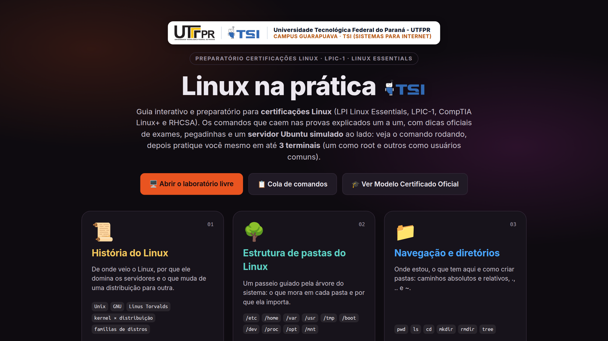
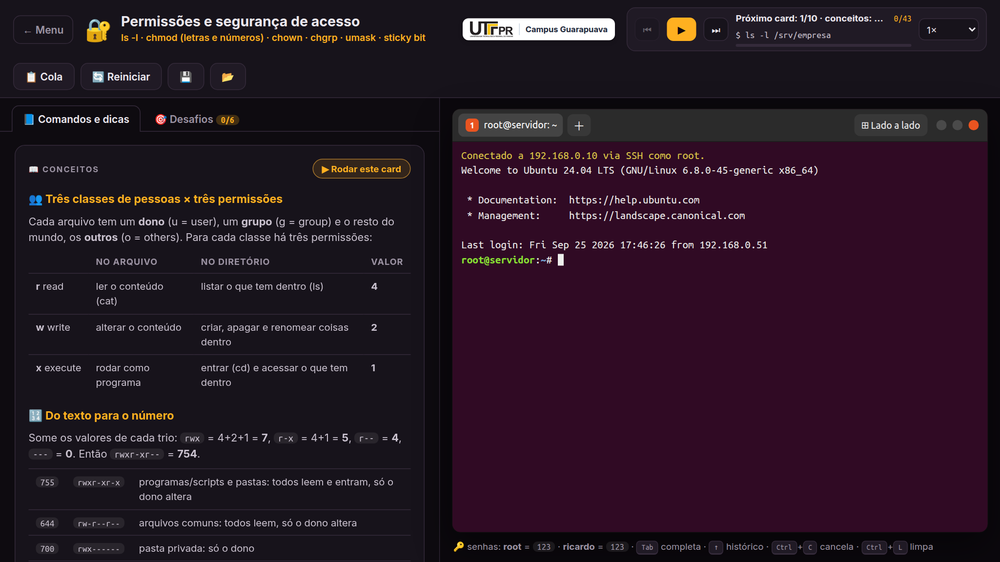
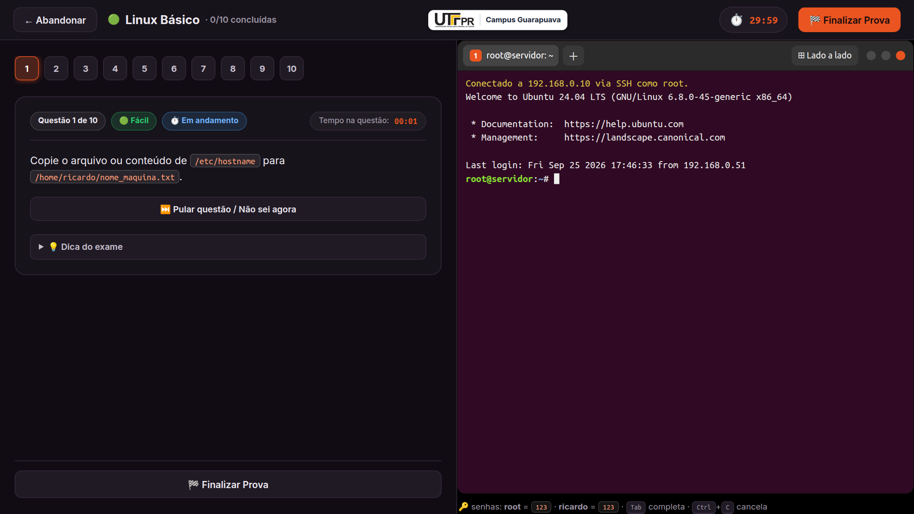
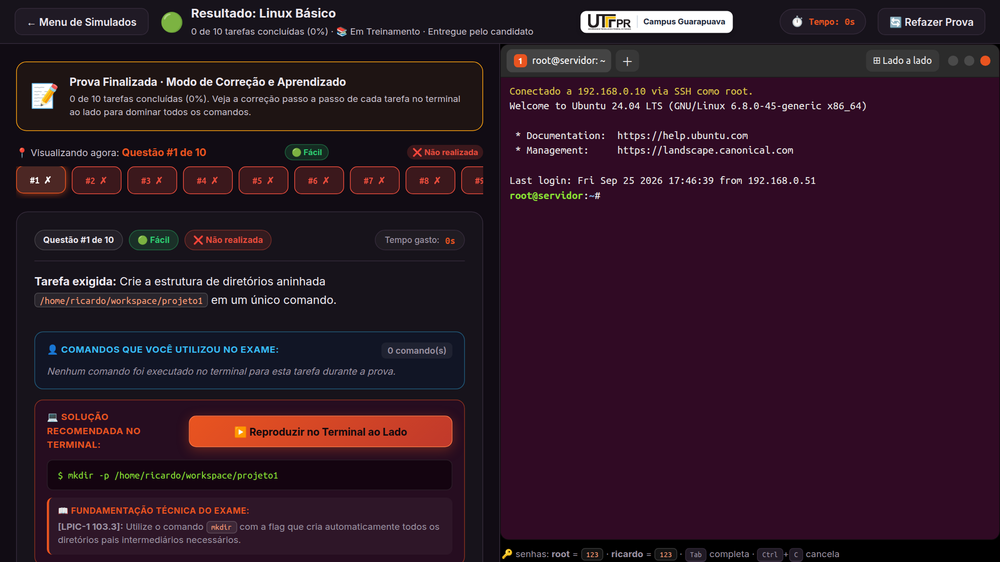
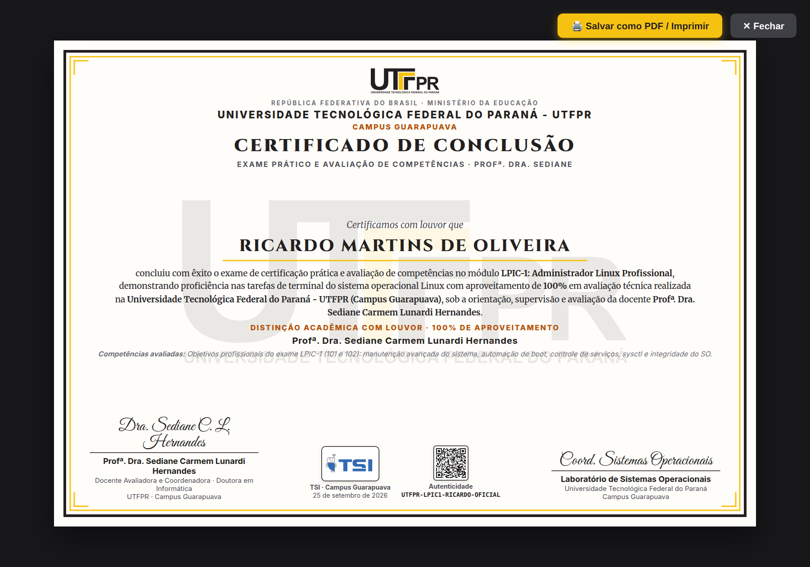

<div align="center">


&nbsp;&nbsp;&nbsp;&nbsp;&nbsp;&nbsp;


<br/>

### Universidade Tecnológica Federal do Paraná - UTFPR
**Campus Guarapuava · Tecnologia em Sistemas para Internet (TSI)**  
*Laboratório de Sistemas Operacionais · Preparatório Oficial para Certificações Linux*

# 🐧 Linux na Prática

### Material de Estudo Interativo + Servidor Ubuntu 24.04 Simulado no Navegador

**Ambiente completo para dominar comandos de terminal, resolução de exames práticos (LPIC-1, Linux Essentials, CompTIA Linux+) e emissão oficial de certificados.**


**Aluno Desenvolvedor:** Ricardo Martins de Oliveira · [GitHub](https://github.com/Roliveira96) · [LinkedIn](https://www.linkedin.com/in/ricardodeoliveira96/) · [rmo.dev.br](https://rmo.dev.br)  
**Docente Avaliadora:** **Profª. Dra. Sediane Carmem Lunardi Hernandes** (Doutora em Informática · PPGIa/PUCPR)  

</div>

---

## 📸 Demonstração Visual do Sistema

Abaixo estão capturas reais do sistema em funcionamento, cobrindo desde a exploração inicial até o exame cronometrado e a geração do certificado:

### 1. Tela Inicial e Hub de Estudos
Apresentação institucional da UTFPR e do curso TSI, cards temáticos com contadores de comandos e acesso rápido aos exames e laboratório livre:



---

### 2. Lições Práticas com Terminal Ubuntu Conectado
Comandos explicados com tabelas de opções, dicas oficiais de prova, pegadinhas de exames e um terminal Ubuntu 24.04 LTS ao lado executando as ações em tempo real:



---

### 3. Modo Simulado de Certificação (Prova em Tempo Real)
Prova com cronômetro regressivo de 30 minutos, tarefas encadeadas, barra de progresso, botão "Pular questão" e até 3 terminais concorrentes (root e usuários normais):



---

### 4. Relatório de Desempenho e Correção Técnica
Placar detalhado exibindo porcentagem de aproveitamento, tempo decorrido, status de aprovação, fundamentação técnica de cada tarefa e botão para emissão de certificado:



---

### 5. Certificado Oficial com Dados Mockados (UTFPR / TSI)
Diploma emitido com padrão gráfico institucional nas cores oficiais da UTFPR (Amarelo e Preto), marca d'água centralizada, selo oficial do curso TSI, assinatura da Profª. Dra. Sediane e QR Code dinâmico para validação digital:



---

## 🚀 Como Rodar o Projeto

### Pré-requisitos
- [Node.js](https://nodejs.org) versão 20.19+ ou 22.12+.
- Gerenciador de pacotes `npm`.

### Execução Local e na Rede

```bash
# 1. Instalar dependências
npm install

# 2. Iniciar servidor de desenvolvimento (acessível via localhost e IP da rede)
npm run dev
```

Acesse no navegador:
- Localmente: **http://localhost:5173**
- Pelo IP da rede local (ex.): **http://192.168.3.111:5173**
- Modelo de certificado oficial direto: **http://localhost:5173/certificado-exemplo.html**

### Testes Automatizados (558 Testes)

```bash
# Executa toda a suíte de testes (validações oficiais e formas alternativas)
npm test

# Executa build de produção com verificação rigorosa de tipos TypeScript
npm run build
```

---

## 📚 Matriz de Conteúdo Curricular

O simulador cobre integralmente a ementa de Sistemas Operacionais da UTFPR e os editais de certificações internacionais:

| # | Módulo | Tópicos e Comandos Abordados |
|---|--------|------------------------------|
| **01** | 📜 História do Linux | Unix, GNU, Linus Torvalds, Kernel vs Distribuição, famílias de distros (Debian/Ubuntu, Red Hat, SUSE, Arch, Alpine). |
| **02** | 🌳 Estrutura de Pastas | Padrão FHS (`/etc`, `/home`, `/root`, `/usr`, `/var`, `/tmp`, `/boot`, `/dev`, `/proc`, `/opt`, `/srv`). |
| **03** | 📁 Navegação e Diretórios | `pwd`, `ls`, `cd`, `mkdir`, `tree`, `rmdir`, caminhos relativos e absolutos. |
| **04** | 📄 Manipulação de Arquivos | `touch`, `echo > >>`, `cat`, `head`, `tail`, `grep`, `wc`, `cp`, `mv`, `ln -s`, editores `nano` e `vim`. |
| **05** | 🗑️ Exclusão e Segurança | `rm`, `rm -r`, `rm -f`, curingas `*` `?`, isolamento e Sticky Bit em `/tmp`. |
| **06** | 🔐 Permissões e Acessos | `ls -l`, `chmod` (letras e números octais 755, 644, 1777), `chown`, `chgrp`, `umask`. |
| **07** | 👥 Usuários e Grupos | `whoami`, `id`, `useradd`, `passwd`, `su`, `sudo`, `usermod -aG`, `groupadd`, `gpasswd`, `/etc/shadow`. |
| **08** | 📦 Pacotes e Serviços | `apt update/upgrade/install/remove/purge`, `dpkg`, `systemctl start/stop/enable`, servidor Nginx. |
| **09** | 📝 Simulados Oficiais | Provas cronometradas para LPIC-1, Linux Essentials, Linux Avançado e Servidor Escola. |

---

## 🏗️ Arquitetura do Simulador

O projeto foi arquitetado em **TypeScript puro**, sem dependência de emuladores pesados ou WebAssembly, funcionando com alta fidelidade às chamadas POSIX:

```
src/
├── linux/              ← O "Kernel" Virtual
│   ├── No.ts               Arquivo, Diretorio, ArquivoGerado (/etc/passwd, shadow), Buraco (/dev/null)
│   ├── SistemaDeArquivos.ts Resolução de caminhos (/, ./, ../, ~) e checagem de permissões rwx
│   ├── Permissoes.ts       Conversão octal ⇄ texto ⇄ simbólico (u+x, g-w, o=)
│   ├── Contas.ts           Controle de usuários, grupos, UIDs, GIDs e integridade de senhas
│   ├── Sessao.ts           Pilha de shells virtuais (su/sudo empilham, exit desempilha)
│   ├── Maquina.ts          Orquestrador global de hardware, rede (IP), serviços e discos
│   ├── Pacotes.ts          Gerenciador APT/dpkg (/var/lib/dpkg/status) e systemd units
│   └── Ssh.ts              Validação de portas SSH, chaves authorized_keys e regras de firewall
├── shell/              ← Interpretador de Linha de Comando (Bash)
│   ├── Analisador.ts       Tratamento de aspas, escapes, $VAR, curingas e pipes (| > >> 2> <)
│   ├── Interpretador.ts    Execução de comandos encadeados, subshells e scripts
│   └── comandos/           Mais de 50 comandos Linux implementados um a um
├── terminal/           ← Interface Gráfica de Terminal
│   ├── TerminalUbuntu.ts   Emulação de terminal GNOME com suporte a cores ANSI, Tab, histórico e login SSH
│   ├── JanelaDeTerminais.ts Suporte a abas e visualização lado a lado simultânea
│   ├── EditorNano.ts       Editor de texto visual com atalhos nano (^O grava, ^X sai)
│   └── EditorVim.ts        Editor modal com comandos (:w, :q, :wq, i, ESC)
├── app/                ← Telas da Aplicação e Emissão de Documentos
│   ├── TelaMenu.ts         Portal inicial e seleção de módulos
│   ├── TelaTopico.ts       Interface de estudo guiado e desafios assistidos
│   ├── TelaSimulado.ts     Ambiente de prova cronometrada, validação e placar
│   ├── GeradorCertificado.ts Gerador do diploma oficial da UTFPR
│   └── QrCodeCertificado.ts Gerador vetorial SVG síncrono de QR Code
└── conteudo/           ← Catálogo e banco de questões teóricas e práticas
```

---

## 📜 Certificação e Autenticidade Digital

Os certificados emitidos pelo sistema contam com:
- **Identidade Institucional da UTFPR:** Cores oficiais Amarelo Ouro (`#F6C212`) e Preto (`#231F20`).
- **Marca d'Água Centralizada:** Brasão da universidade em alta definição com transparência calibrada a 9%.
- **Selo Oficial do Curso TSI:** Logotipo do curso de Tecnologia em Sistemas para Internet do Campus Guarapuava.
- **Assinatura Acadêmica:** Homologação da **Profª. Dra. Sediane Carmem Lunardi Hernandes**.
- **QR Code Vetorial:** Código escaneável e registro exclusivo para validação online.

---

## 👥 Créditos e Agradecimentos

- **Universidade Tecnológica Federal do Paraná (UTFPR) - Campus Guarapuava**
- **Curso Superior de Tecnologia em Sistemas para Internet (TSI)**
- **Docente Orientadora:** Profª. Dra. Sediane Carmem Lunardi Hernandes
- **Desenvolvedor:** Ricardo Martins de Oliveira

---

<div align="center">
  <sub>UTFPR Campus Guarapuava · Laboratório de Sistemas Operacionais · 2026</sub>
</div>
